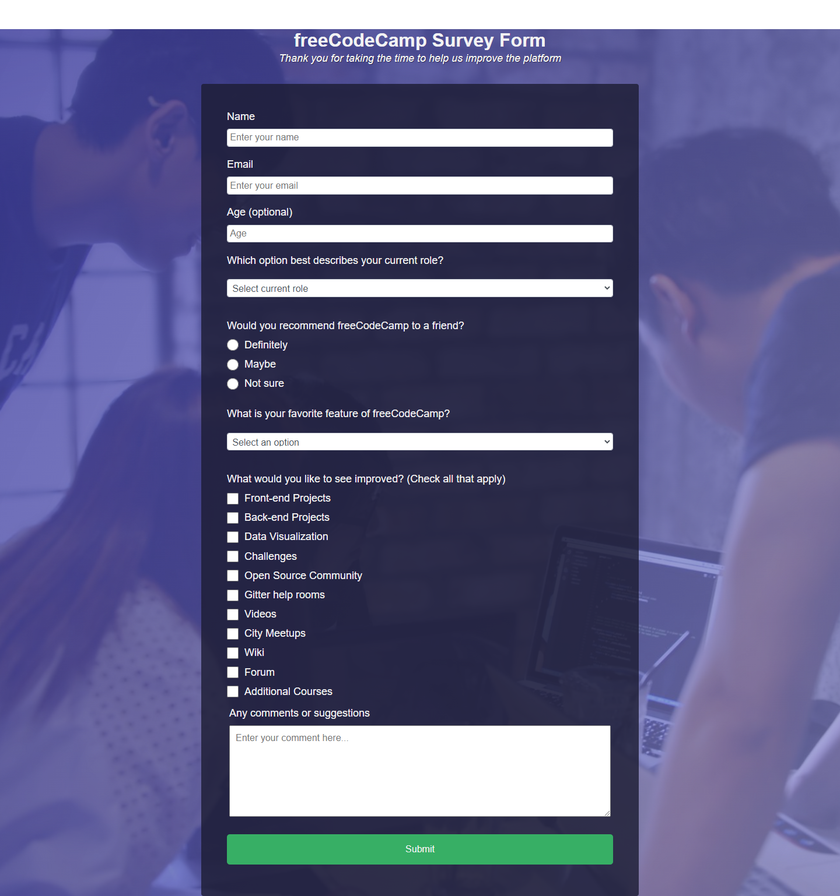

# Survey Form - FreeCodCamp
Formulário desenvolvido no curso de web design responsive do freecodcamp

### Como inicar o projeto: 

- Basta baixar o código em formato zip.
- Abrir o arquivo index.html em seu navegador de preferência.

## Tecnologias e Dependências

| Name | Link |
| ------ | ------ |
| HTML5 | [https://www.w3schools.com/html/] |
| CSS | [https://www.w3schools.com/css/] |
